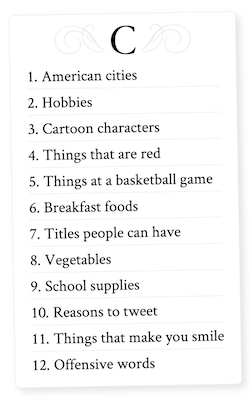

# Gary, a word game

Gary is a word game for 2 or more players.
Its rules are similar to [Scattergories](http://www.fgbradleys.com/rules/Scattergories.pdf), itself based on traditional games like Tutti Frutti.

## License
Licensed under [the Apache License, v2.0](http://www.apache.org/licenses/LICENSE-2.0) (the 'License').

Unless required by law or agreed in writing, software distributed under the License
is distributed on an **'as is' basis, without warranties or conditions**, express or implied.
See the [License](LICENSE.txt) for the specific language governing permissions and limitations.

&copy; Keiran King
